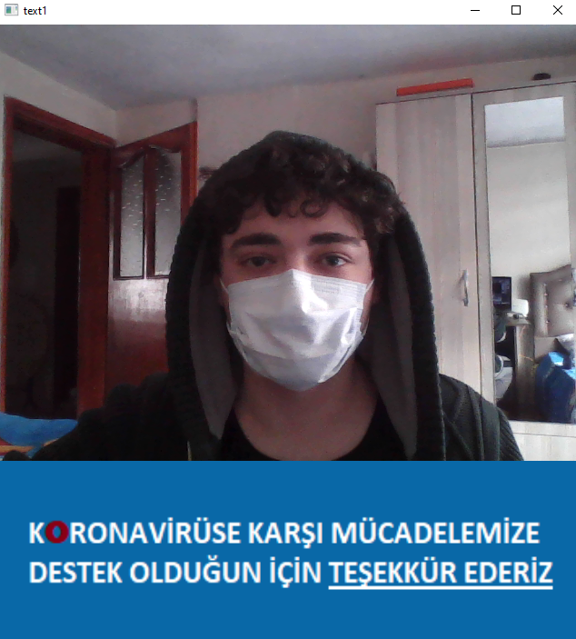
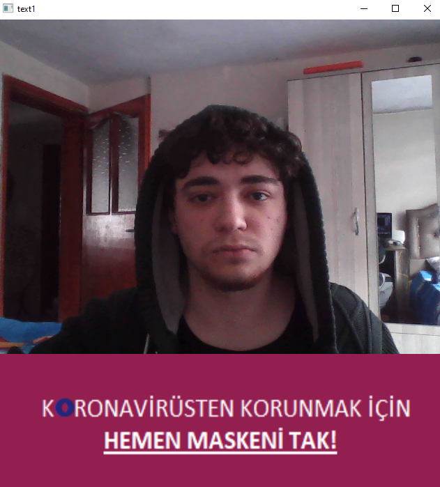

# Mask Detection With Haarcascades

 

  The logic is simple. I used 2 haarcascade. First one for face, other one for mouth. If there is a face and there is not mouth then masked. If there is a face and mouth then unmasked.
